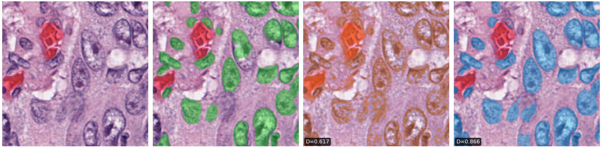
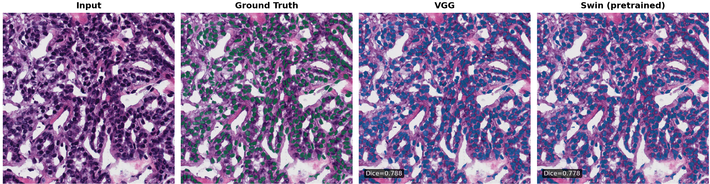

<!-- _class: title -->

# When Simple Wins: CNN vs. Transformer Encoders for Low-Data Nucleus Segmentation
## CNN vs. Transformer in the Low-Data Regime

Danny Rollo  
Khoury College of Computer Sciences, Northeastern University  
CS 7150 — Spring 2026

---

# Problem Setting

**The gap:** Pathology foundation models (UNI 307M, Virchow2 632M params) require large amounts of GPU memory for full fine-tuning, restricting most users to linear probing. This rules out edge-deployed microscopy scanners in rural clinics, mobile pathology units run by organizations like MSF on laptop hardware, under-resourced labs studying rare diseases or animal models on a single consumer GPU, and any non-H&E staining protocol where H&E-pretrained weights don't transfer regardless of scale.

**Question:** Among *lightweight, from-scratch* architectures, which encoder works best with limited data?

| | |
|---|---|
| **Input** | 256×256 H&E-stained histopathology patch |
| **Output** | Binary mask — nucleus vs. background |
| **PanNuke** | ~5K training patches, 19 tissue types |
| **MoNuSeg** | 37 training whole-slide images — genuinely small-data |

---

# Problem Setting — The Task

Input → Ground Truth → Classical baseline (Otsu) → Our best model (VGG)

---

# Baseline & What We Built

**Classical baseline — Otsu Thresholding** (0 params) — Dice **0.482**

**Our contribution: U-Net with a fixed decoder and shared encoder interface**

The decoder, loss, optimizer, and training schedule are held constant.  
The **encoder backbone is the only variable** — swapped via config.

| Encoder | Architecture | Params | Pretrained? |
|---|---|---|---|
| VGG | Stacked 3×3 convs, max-pool | 34M | No |
| ResNet | Residual blocks, stride-2 down | 37.5M | No |
| Swin-T (scratch) | Shifted-window attention | 86.8M | No |
| Swin-T (pretrained) | Shifted-window attention | 86.8M | ImageNet |

**MedT** (Valanarasu et al., MICCAI 2021) — gated axial-attention transformer built for small medical datasets — serves as the published baseline on MoNuSeg. Dice **0.796**, 1.4M params.

---

# Results

<strong>PanNuke (fold 3)</strong>
<table>
<thead><tr><th>Encoder</th><th>Dice ↑</th><th>IoU ↑</th><th>Params</th></tr></thead>
<tbody>
<tr><td>Otsu (classical)</td><td>0.482</td><td>0.349</td><td>0</td></tr>
<tr><td>Swin-T (scratch)</td><td>0.590</td><td>0.442</td><td>86.8M</td></tr>
<tr><td>Swin-T (pretrained)</td><td>0.802</td><td>0.676</td><td>86.8M</td></tr>
<tr><td>ResNet</td><td>0.849</td><td>0.740</td><td>37.5M</td></tr>
<tr><td><strong>VGG</strong></td><td><strong>0.851</strong></td><td><strong>0.744</strong></td><td><strong>34.0M</strong></td></tr>
</tbody>
</table>

<strong>MoNuSeg test set</strong>
<table>
<thead><tr><th>Model</th><th>Dice ↑</th><th>IoU ↑</th><th>Params</th></tr></thead>
<tbody>
<tr><td>MedT (30 train imgs)</td><td>0.796</td><td>0.662</td><td>1.4M</td></tr>
<tr><td>Swin-T pretrained (37 imgs)</td><td>0.750</td><td>0.604</td><td>86.8M</td></tr>
<tr><td><strong>VGG (37 imgs)</strong></td><td><strong>0.796</strong></td><td><strong>0.663</strong></td><td><strong>34.0M</strong></td></tr>
</tbody>
</table>

---

# Key Findings

**(1) Transformers without pretraining barely learn useful features at this scale**
Swin from scratch barely beats Otsu: **0.590 vs 0.482** Dice — without pretraining, transformers barely learn useful features at this data scale.

**(2) Residual connections add nothing at 4 stages**
VGG = ResNet: **0.851 vs 0.849** — skip connections solve gradient degradation in *deep* networks; at 4 encoder stages neither architecture degrades.

**(3) CNN matches purpose-built small-data transformer**
VGG matches MedT (**0.796 vs 0.796**) — a transformer with gated axial-attention designed specifically for small medical datasets — while outperforming pretrained Swin (0.750). Convolutional inductive bias is the decisive advantage in the low-data regime.

---

# Results — MoNuSeg Qualitative (Input | Ground Truth | VGG | Swin)

